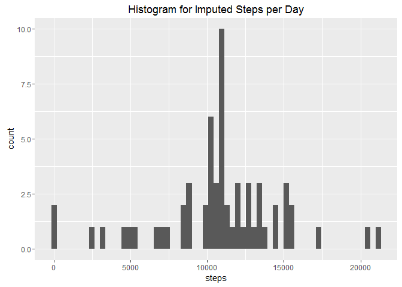

# Reproducible Research: Peer Assessment 1


## Loading and preprocessing the data


```r
library(ggplot2)
library(plyr)

# Obtain data from https://d396qusza40orc.cloudfront.net/repdata%2Fdata%2Factivity.zip
# After downloading, unzip and copy extracted file (activity.csv) to local directory.

df.RAW <- read.csv("activity.csv")
str(df.RAW)
```

```
## 'data.frame':	17568 obs. of  3 variables:
##  $ steps   : int  NA NA NA NA NA NA NA NA NA NA ...
##  $ date    : Factor w/ 61 levels "2012-10-01","2012-10-02",..: 1 1 1 1 1 1 1 1 1 1 ...
##  $ interval: int  0 5 10 15 20 25 30 35 40 45 ...
```

## What is mean total number of steps taken per day?


```r
# Determine steps per day
df.SPD <- ddply(df.RAW, .(date), summarize, steps=sum(steps, na.rm=TRUE))

# Display steps as a histogram 
p <- ggplot(data=df.SPD) + geom_histogram(aes(steps), bins=nrow(df.SPD)) 
p <- p + ggtitle("Histogram for Steps per Day") 
print(p)
```


```r
# Display mean and median, plus additional summary data of steps taken per day
print( summary(df.SPD$steps) )
```

```
##    Min. 1st Qu.  Median    Mean 3rd Qu.    Max. 
##       0    6778   10400    9354   12810   21190
```

## What is the average daily activity pattern?


```r
# Determine average steps taken every day by 5-minute time intervals
df.SPI <- ddply(df.RAW, .(interval), summarize, msteps=mean(steps, na.rm=TRUE))

# Display a time series plot
p <- ggplot(df.SPI, aes(interval, msteps)) + geom_line() + ggtitle("Time Series Steps per Interval")
print(p)
```


```r
# Which interval has the maximum number of average steps?
i <- with(df.SPI, which(msteps == max(msteps)))
print(df.SPI[i, ])
```

```
##     interval   msteps
## 104      835 206.1698
```

## Imputing missing values


```r
# How many records in our data set contain NAs?
print( sum(is.na(df.RAW)) )
```

```
## [1] 2304
```

```r
# Create new data set with imputed values replacing NA values
df.IMP <- join(df.RAW, df.SPI, by="interval")
naFilter <- is.na(df.IMP)
df.IMP[naFilter,]$steps <- df.IMP[naFilter,]$msteps

# Determine steps per day with imputed data
df.SPD2 <- ddply(df.IMP, .(date), summarize, steps=sum(steps))

# Display steps as a histogram 
p <- ggplot(data=df.SPD2) + geom_histogram(aes(steps), bins=nrow(df.SPD2))
p <- p + ggtitle("Histogram for Imputed Steps per Day") 
print(p)
```



```r
# Display mean and median, plus additional summary data of steps taken per day
print( summary(df.SPD2$steps) )
```

```
##    Min. 1st Qu.  Median    Mean 3rd Qu.    Max. 
##      41    9819   10770   10770   12810   21190
```

Some observations regarding the impact of imputing missing data on the estimates of the total daily number of steps:

- The mean number of steps increased
- The median number of steps increased
- The histogram no longer represents zero steps as heavily, and is more centrally aligned

## Are there differences in activity patterns between weekdays and weekends?


```r
# Create and assign factor for weekday vs. weekend
df.IMP$weekday <- weekdays(as.Date(df.IMP$date))
df.IMP$dayType <- ifelse( df.IMP$weekday %in% c("Saturday","Sunday"), "weekend", "weekday" )
df.IMP$dayType <- as.factor(df.IMP$dayType)

# Determine average steps taken per interval, grouped by day type
df.SPI2 <- ddply(df.IMP, .(interval, dayType), summarize, msteps=mean(steps))

# Display a panel time series plot, grouped by day type
p <- ggplot(df.SPI2, aes(interval, msteps)) + geom_line() + facet_grid(. ~ dayType)
p <- p + ggtitle("Time Series Steps per Interval")
print(p)
```


